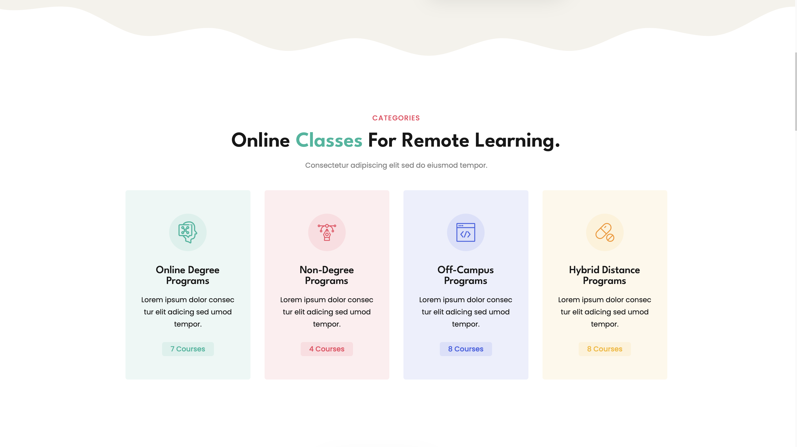
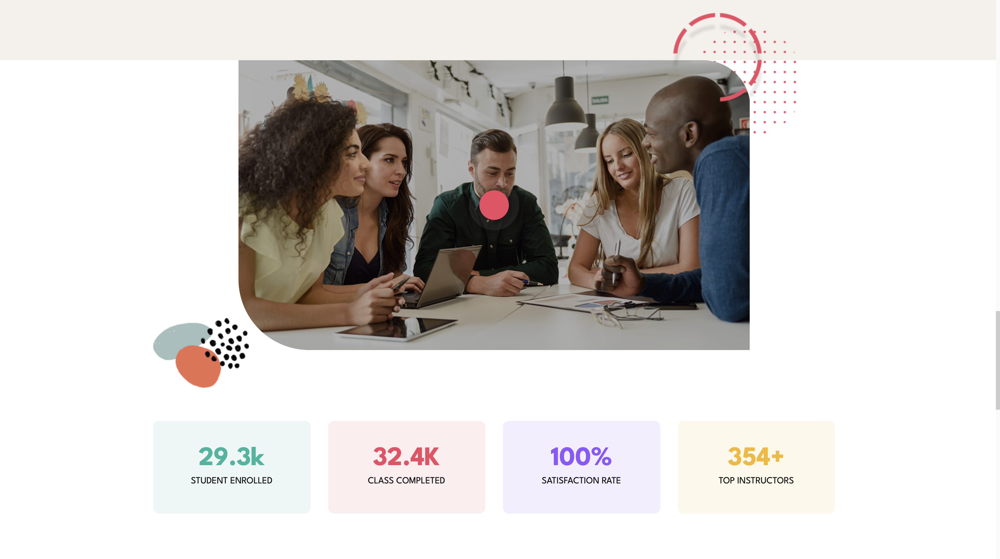
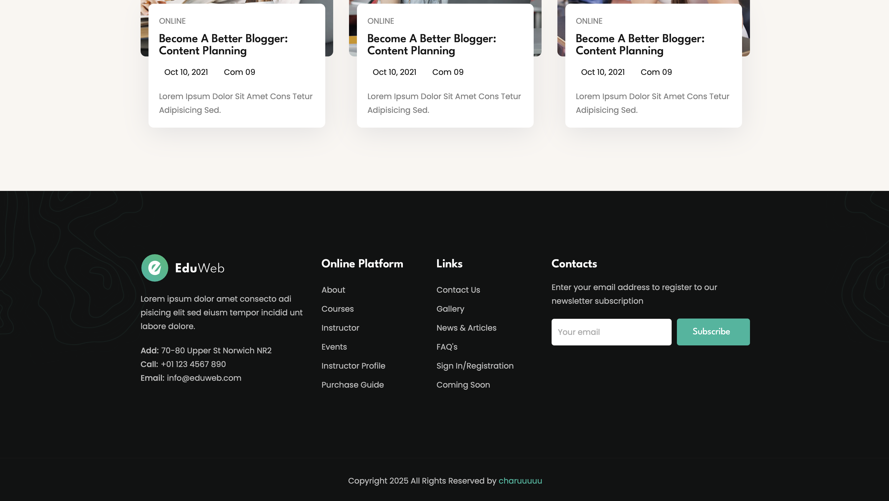

<h1 align="center">Eduweb   </h1>

Welcome to Eduweb , a project by [Charu](https://github.com/CH4RUU).

<h2 align="center">Website Link</h2>
https://ch4ruu.github.io/edwebsite/
<h2 align="center">Overview</h2>

**Eduweb** is a modern educational platform designed to provide a seamless and engaging learning experience. With an intuitive UI and interactive features, it aims to enhance online education accessibility.

<h2 align="center">Project Structure</h2>

- **`index.html`**: The main landing page of the website.
- **`styles.css`**: Contains all the styling rules for the website.
- **`script.js`**: Handles the interactive functionalities and user interactions.
- **Directories**:
  - **`images/`**: All graphical assets and images.

  <ul>
  <li><strong>Front-End:</strong>
    
    
    
  </li>
</ul>

<h2 align="center">Features</h2>

- **Interactive Content**: Engaging videos and animations to educate users.
- **Responsive Design**: Optimized for various devices and screen sizes.
- **User-Friendly Interface**: Intuitive navigation and layout.
- [DEMO LINK](https://ch4ruu.github.io/edwebsite/)

<h2 align="center">Snippets</h2>

<div align="center">
  
  
  
  
</div>
## Getting Started

1. **Clone the Repository**:

   ```bash
   git clone https://github.com/CH4RUU/edwebsite.git

  
<h2 align="center">Contributing     </h2>

Contributions are welcome! Please fork the repository and submit a pull request for any enhancements or bug fixes.


